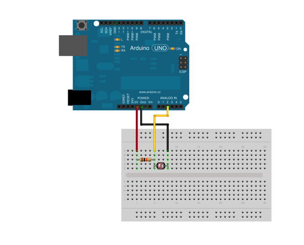

#Raspberry Pi Serial Tutorial 1

This tutorial prints vertical bands to a webpage depending on light levels in a physical space. It uses Node.js running on Raspbian Linux on a Raspberry Pi (RasPi) mini-computer to drive an Arduino-compatible microcontroller to connect the inputs from an analog photoresistor.

##Hardware Dependencies

*	Raspberry Pi running Raspbian Linux
*	Arduino (Uno, Mega or clone) and assembly (breadboard, resistors, serial cable, etc)
*	Photoresistor

##Software Dependencies

*	Raspbian (Wheezy) Linux distribution
*	Node.js v0.10.x
	*	Express web framework
	*	Johnny Five (depends on Serialport)
	*	Firmata for Node.js
	*	Web sockets
*	Firmata for Arduino

##Setup Diagram

##Instructions

1.	Fork this repository
2.	Clone your forked repository into your ~/2013/site-to-site/tutorials/ folder

	$ sudo git clone https://github.com/<your_git_username>/RaspiSerial-Tutorial-1.git

3.	Connect an Arduino (or clone) to your RasPi through the serial cable (use the USB ports)
4.	Wire up an Arduino to a photoresistor as illustrated below:

[docs/assets/RaspiSerial-Tutorial-1-arduino.fzz](docs/assets/RaspiSerial-Tutorial-1-arduino.fzz)