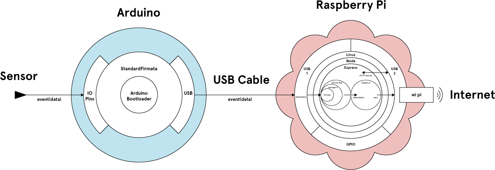

#Raspberry Pi Serial Tutorial 1

This tutorial prints vertical bands to a webpage depending on light levels in a physical space. It uses Node.js running on Raspbian Linux on a Raspberry Pi (RasPi) mini-computer to drive an Arduino-compatible microcontroller to connect the inputs from an analog photoresistor.

##Hardware Dependencies

*	Raspberry Pi model B
*	Arduino (Uno, Mega or clone) and assembly (breadboard, resistors, serial cable, jumper wires, etc)
*	Photoresistor

##Software Dependencies

*	Raspbian (Wheezy) Linux distribution
*	Node.js v0.10.x
	*	Express web framework
	*	Johnny Five (depends on Serialport)
	*	Firmata for Node.js
	*	Web sockets
*	Firmata for Arduino

##Hardware Diagram

Detail

[docs/assets/RaspiSerial-Tutorial-1-hardware.ai](docs/assets/RaspiSerial-Tutorial-1-hardware.ai)

##Setup Instructions

1.	Fork this repository
2.	SSH into your Raspberry Pi and clone your forked repository into your ~/2013/site-to-site/tutorials/ folder

		$ sudo git clone https://github.com/<your_git_username>/RaspiSerial-Tutorial-1.git

3.	Connect your Arduino (or clone) to your computer using the serial cable (through the USB port), open the Arduino IDE and upload the StandardFirmata example sketch to your Arduino (find it under File > Examples > Firmata > StandardFirmata).
4.	Close the Arduino IDE, then disconnect your Arduino (or clone) from your computer and connect it to your RasPi through the same serial cable (use the USB ports)
5.	Wire up an Arduino (or clone) to a photoresistor as illustrated below:

[docs/assets/RaspiSerial-Tutorial-1-arduino.fzz](docs/assets/RaspiSerial-Tutorial-1-arduino.fzz)
6.	You will now run the tutorial by passing the node execution command to the Raspberry Pi through SSH. Naviagate to the directory in which you cloned the forked tutorial repository, then enter the following:

		$ cd app
		$ sudo node app.js

7.	Open a browser on your computer and navigate to the IP you set your Raspberri Pi to in the Raspi-Setup instructions with the correct port number, achieved by appending a colon and the number (eg. in full the URL in your browser should read something like 169.254.128.1:3000). Here, you should see an active display that updates as the light available to the photoresistor changes. Try it out by covering the photoresistor, or increasing the light that shines on it.

##Assignment

1.	Read through the code comments and the flow diagrams to understand how the tutorial works.
2.	Complete the assignments in the assignment folder

##License

MIT